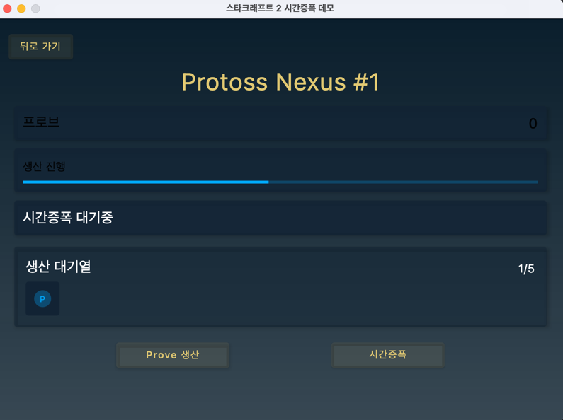
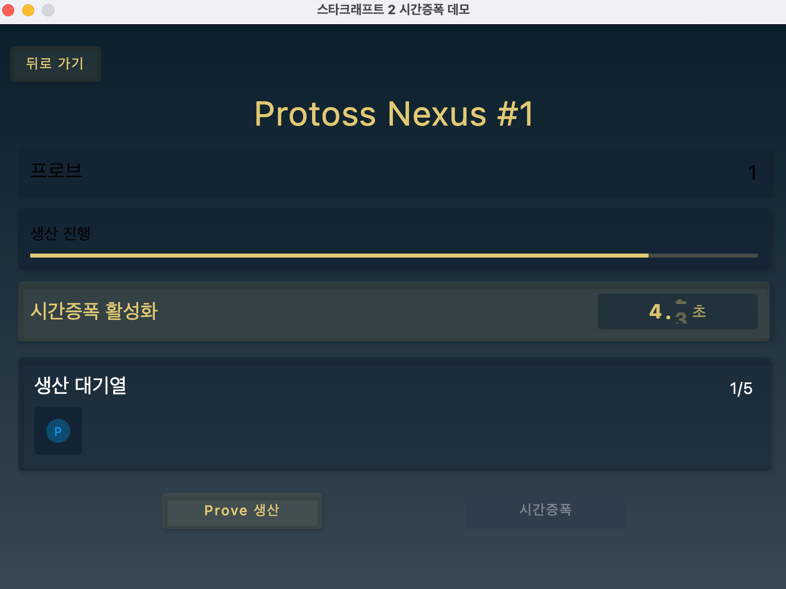

# Starcraft Protoss Timeaplification Demo app

## Introduction
스타크래프트2의 프로토스 종족에는 '시간증폭'이라는 독특한 메커니즘이 있다. 연결체가 건물에 시간증폭을 사용하면 해당 건물의 생산 속도가 일정 시간 동안 빨라진다. 이런 시간 기반 가속 시스템을 코틀린의 코루틴 Flow를 사용해 구현해보자.

## Design
먼저 시간증폭의 핵심 메커니즘을 살펴보자:

- 시간증폭은 건물에 적용되며 일정 시간(예: 20초) 동안 지속된다
- 적용 중인 동안 생산 속도가 (예: 200%) 증가한다
- 증폭 효과는 건물마다 별도로 적용된다.

이러한 시스템을 코루틴 Flow로 구현하면 비동기적인 이벤트 스트림을 효과적으로 다룰 수 있다.
